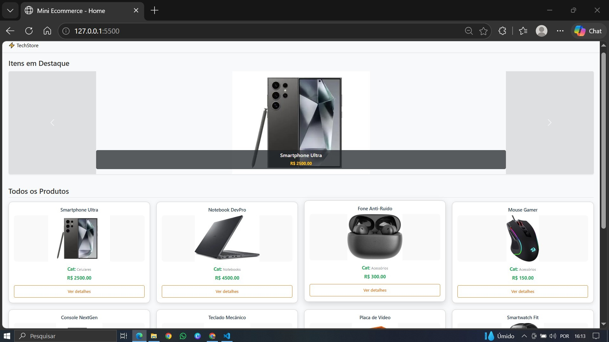
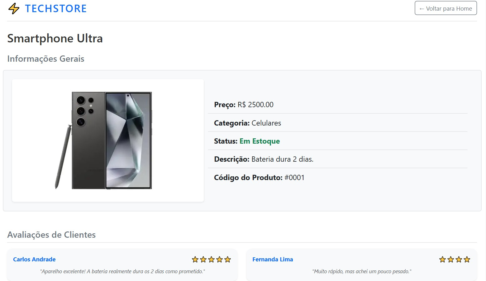

# ⚡ TechStore - E-commerce Dinâmico

Projeto prático desenvolvido para a disciplina de **Desenvolvimento Web** na **PUC Minas**. A aplicação consiste em um mini e-commerce responsivo que consome dados estruturados em formato JSON para renderizar componentes de interface de forma 100% dinâmica via JavaScript puro (Vanilla JS).

---

## 👨‍💻 Dados do Aluno
* **Nome:** Andrew Kaique Ferreira de Paula
* **Matrícula:** 927993
* **Curso:** Sistemas de Informação
* **Instituição:** PUC Minas Barreiro

---

## 📸 Prints das Telas (Capturas de Tela)

### 1. Home-page (`index.html`)
A página inicial apresenta uma seção com os produtos em destaque utilizando o componente **Carrossel do Bootstrap**, e a listagem geral exibindo os produtos perfeitamente alinhados em **4 colunas por linha**, cobrindo toda a extensão da tela de ponta a ponta.


### 2. Página de Detalhes (`detalhes.html`)
Acessada dinamicamente ao clicar em "Ver detalhes" de um card ou slide através de parâmetros passados via *Query String* (`?id=X`). Apresenta o layout personalizado individualmente com as 5 especificações obrigatórias da entidade principal e os cards da entidade secundária (**Avaliações de Clientes**).


---

## 🗃️ Estrutura de Dados (JSON do arquivo `script.js`)

Esta é a estrutura de objetos e arrays utilizada no script principal para centralizar e distribuir dinamicamente os dados para as duas páginas do e-commerce:

```javascript
const data = {
    produtos: [
        { 
            id: 1, 
            nome: "Smartphone Ultra", 
            preco: 2500.00, 
            categoria: "Celulares", 
            imagem: "[https://tse1.mm.bing.net/th/id/OIP.RCaOvi3C_QXx33EUvGht9wHaFj?rs=1&pid=ImgDetMain&o=7&rm=3](https://tse1.mm.bing.net/th/id/OIP.RCaOvi3C_QXx33EUvGht9wHaFj?rs=1&pid=ImgDetMain&o=7&rm=3)", 
            descricao: "Bateria dura 2 dias.", 
            emEstoque: true, 
            destaque: true,
            avaliacoes: [
                { usuario: "Carlos Andrade", nota: 5, comentario: "Aparelho excelente! A bateria realmente dura os 2 dias como prometido." },
                { usuario: "Fernanda Lima", nota: 4, comentario: "Muito rápido, mas achei um pouco pesado." }
            ]
        },
        { 
            id: 2, 
            nome: "Notebook DevPro", 
            preco: 4500.00, 
            categoria: "Notebooks", 
            imagem: "[https://tse3.mm.bing.net/th/id/OIP.uc-3epC0JFm-AQ2YC4kEmgHaFU?rs=1&pid=ImgDetMain&o=7&rm=3](https://tse3.mm.bing.net/th/id/OIP.uc-3epC0JFm-AQ2YC4kEmgHaFU?rs=1&pid=ImgDetMain&o=7&rm=3)", 
            descricao: "16GB RAM e SSD.", 
            emEstoque: true, 
            destaque: true,
            avaliacoes: [
                { usuario: "Roberto Silva", nota: 5, comentario: "Perfeito para programar e rodar máquinas virtuais." }
            ]
        },
        { 
            id: 3, 
            nome: "Fone Anti-Ruído", 
            preco: 300.00, 
            categoria: "Acessórios", 
            imagem: "[https://techinsider.com.br/wp-content/uploads/2023/09/TWS-sem-fio-Bluetooth-Xiaomi-Redmi-Buds-4-Pro.jpg](https://techinsider.com.br/wp-content/uploads/2023/09/TWS-sem-fio-Bluetooth-Xiaomi-Redmi-Buds-4-Pro.jpg)", 
            descricao: "Silêncio absoluto.", 
            emEstoque: false, 
            destaque: false,
            avaliacoes: [
                { usuario: "Marina Souza", nota: 3, comentario: "Bom, mas machuca a orelha depois de 3 horas de uso." },
                { usuario: "Lucas Mendes", nota: 5, comentario: "O cancelamento de ruído é surreal pelo preço." }
            ]
        },
        { 
            id: 4, 
            nome: "Mouse Gamer", 
            preco: 150.00, 
            categoria: "Acessórios", 
            imagem: "[https://tse1.mm.bing.net/th/id/OIP.A1biU9xwjcQj7dxM5MpCFwHaKp?rs=1&pid=ImgDetMain&o=7&rm=3](https://tse1.mm.bing.net/th/id/OIP.A1biU9xwjcQj7dxM5MpCFwHaKp?rs=1&pid=ImgDetMain&o=7&rm=3)", 
            descricao: "LEDs RGB configuráveis.", 
            emEstoque: true, 
            destaque: false,
            avaliacoes: []
        },
        { 
            id: 5, 
            nome: "Console NextGen", 
            preco: 3500.00, 
            categoria: "Games", 
            imagem: "[https://tse2.mm.bing.net/th/id/OIP.-C9exhxGDmboHhY_S629ogHaHa?rs=1&pid=ImgDetMain&o=7&rm=3](https://tse2.mm.bing.net/th/id/OIP.-C9exhxGDmboHhY_S629ogHaHa?rs=1&pid=ImgDetMain&o=7&rm=3)", 
            descricao: "Gráficos em 4K.", 
            emEstoque: true, 
            destaque: true,
            avaliacoes: [
                { usuario: "João Pedro", nota: 5, comentario: "Melhor compra do ano! Os exclusivos estão incríveis." }
            ]
        },
        { 
            id: 6, 
            nome: "Teclado Mecânico", 
            preco: 400.00, 
            categoria: "Acessórios", 
            imagem: "[https://tse3.mm.bing.net/th/id/OIP.H22plLMPetCCE9v9JhR_UAHaHa?rs=1&pid=ImgDetMain&o=7&rm=3](https://tse3.mm.bing.net/th/id/OIP.H22plLMPetCCE9v9JhR_UAHaHa?rs=1&pid=ImgDetMain&o=7&rm=3)", 
            descricao: "Switch Blue barulhento e tátil.", 
            emEstoque: true, 
            destaque: false,
            avaliacoes: []
        },
        { 
            id: 7, 
            nome: "Placa de Vídeo", 
            preco: 3970.00, 
            categoria: "Hardware", 
            imagem: "[https://tse3.mm.bing.net/th/id/OIP.Th2pLNMVrWlCMZtX1yP78AHaHa?rs=1&pid=ImgDetMain&o=7&rm=3](https://tse3.mm.bing.net/th/id/OIP.Th2pLNMVrWlCMZtX1yP78AHaHa?rs=1&pid=ImgDetMain&o=7&rm=3)", 
            descricao: "Placa de vídeo de alto desempenho", 
            emEstoque: true, 
            destaque: false,
            avaliacoes: [
                { usuario: "Vitor Hugo", nota: 4, comentario: "Roda tudo no ultra, mas esquenta bastante." }
            ]
        },
        { 
            id: 8, 
            nome: "Smartwatch Fit", 
            preco: 800.00, 
            categoria: "Acessórios", 
            imagem: "[https://m.media-amazon.com/images/I/81BabF31g8L._AC_.jpg](https://m.media-amazon.com/images/I/81BabF31g8L._AC_.jpg)", 
            descricao: "Mede batimentos e passos.", 
            emEstoque: true, 
            destaque: false,
            avaliacoes: []
        }
    ]
};
